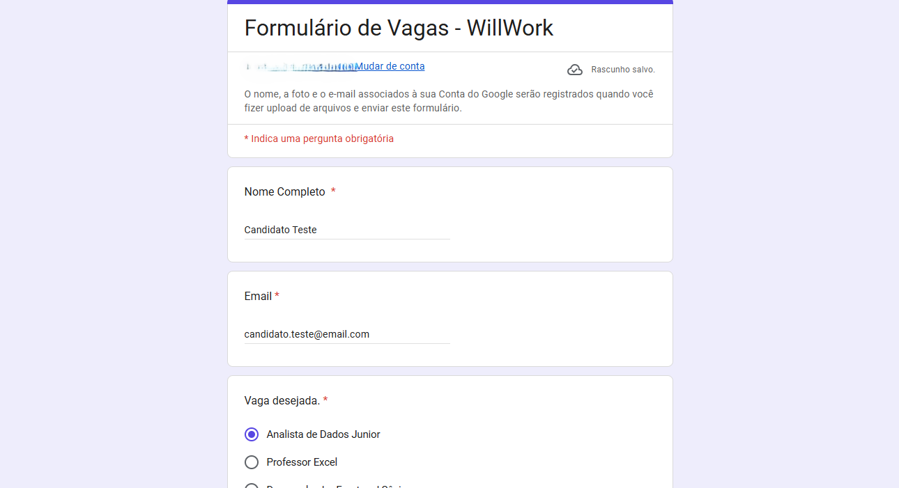
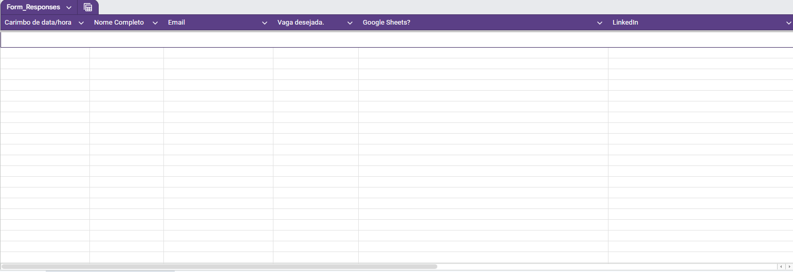
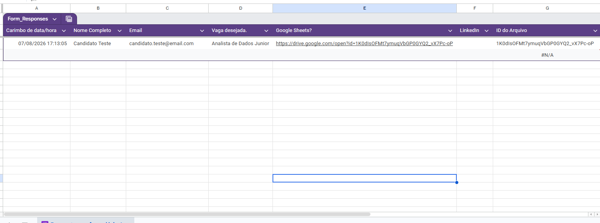
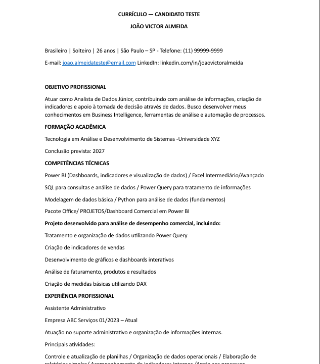
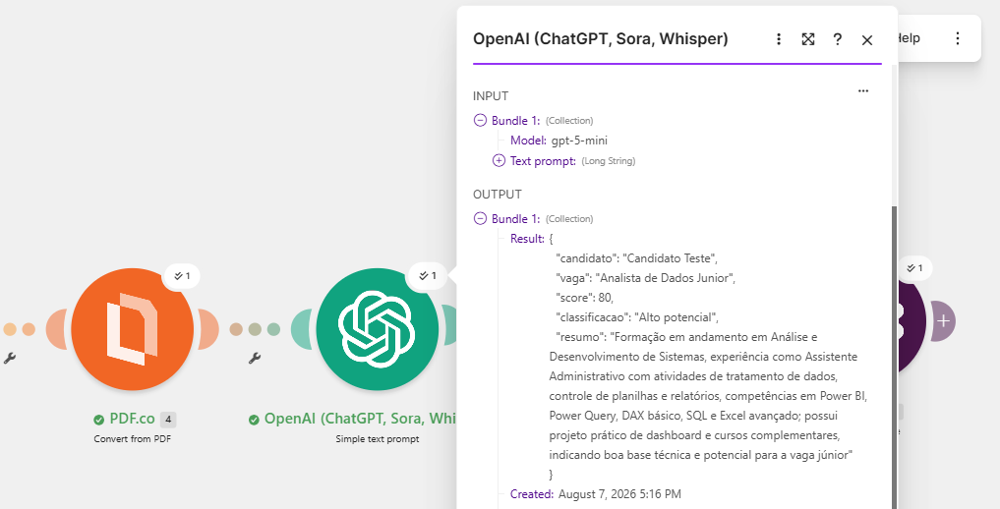

# 🤖 WillWork AI Recruiter

Automação inteligente para análise de currículo utilizando IA, Make, Google Workspace e Slack.

## 📸 Demonstração do projeto

### Fluxo da automação no Make

### Formulário de candidatura

### Dados armazenados no Google Sheets (antes do envio)

### Dados recebidos no Google Sheets

### Currículo utilizado no teste

### Análise realizada pela Inteligência Artificial

